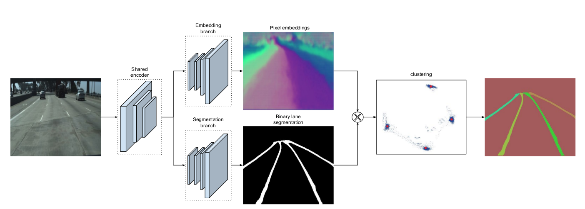
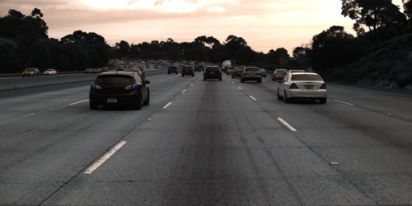

# Lanenet-Lane-Detection (pytorch version)
  
[中文版](https://github.com/IrohXu/lanenet-lane-detection-pytorch/blob/main/CHINESE_README.md)  

## Introduction   
Use pytorch to implement a Deep Neural Network for real time lane detection mainly based on the IEEE IV conference paper "Towards End-to-End Lane Detection: an Instance Segmentation Approach".You can refer to their paper for details https://arxiv.org/abs/1802.05591. This model consists of ENet encoder, ENet decoder for binary semantic segmentation and ENet decoder for instance semantic segmentation using discriminative loss function.  

The main network architecture is:  


## Generate Tusimple training set/validation set/test tet   
First, download tusimple dataset [here](https://github.com/TuSimple/tusimple-benchmark/issues/3).  
Then, run the following command to generate the training/ val/ test samples and the train.txt/ val.txt/ test.txt file.   
Generate training set:  
```
python tusimple_transform.py --src_dir path/to/your/unzipped/file --val False
```
Generate training/ val set:  
```
python tusimple_transform.py --src_dir path/to/your/unzipped/file --val True
```
Generate training/ val/ test set:  
```
python tusimple_transform.py --src_dir path/to/your/unzipped/file --val True --test True
```
path/to/your/unzipped/file should like this:  
```
|--dataset
|----clips
|----label_data_0313.json
|----label_data_0531.json
|----label_data_0601.json
|----test_label.json
```

## Convert dataset from CULane to TuSimple
CULane like this:
```
|--dataset
|----folder_image_1
|------img_1.jpg
|------img_1.lines.jpg
|------img_2.jpg
|------img_2.lines.jpg
|------img_3.jpg
|------ ...
|----folder_image_2
|------img_1.jpg
|------img_1.lines.jpg
|------img_2.jpg
|------...
```
You can see the sample at ```dataset/dataset```.
Run this cell to get the data images (change the path accordingly):
```
python split_image.py
```
Run the cells below to convert from CULane to TuSimple:
```
python convert_to_tusimple.py
```
Adjust the following path according to your data:
```
img_path = 'clips/data'
culane_labels_dir = 'dataset/MOVI1818_image'
output_json_path = 'dataset_test/label_data_data.json'
```
Beside, ```create_test_label.py``` is used to create a test set with the first 20 images of the dataset.
Finally, run the following command to create a suitable dataset for training and validation:
```
python tusimple_transform.py --src_dir path/to/dataset_tusimple --val True
```
Example:
```
python tusimple_transform.py --src_dir dataset/dataset_tusimple --val True
```
## Training the model    
The environment for training and evaluation:  
```
python=3.6
torch>=1.2
numpy=1.7
torchvision>=0.4.0
matplotlib
opencv-python
pandas
```
## Training Instructions
To train a lane detection model, use the following CLI options:
```
python train.py --dataset <path/to/your/dataset> --model_type <model_type> [OPTIONS]
```
Sure! Continuing with the updated format for the README file, here's the rest of the **Training Instructions** section.

---

## Training Instructions
To train a lane detection model, use the following CLI options:

```
python train.py --dataset <path/to/your/dataset> --model_type <model_type> [OPTIONS]
```

### Required Arguments
- `--dataset`: Path to the dataset, which should contain `train.txt` and `val.txt`.
- `--model_type`: Choose the model to train. Available options are:
  - `lanenet`
  - `scnn`
  - `laneatt`

### Optional Arguments
- `--loss_type`: The type of loss function to use for training. Default is `FocalLoss`.
- `--save`: Directory where model checkpoints and logs will be saved. Default is `./log`.
- `--epochs`: Number of training epochs. Default is `25`.
- `--width`: Resize width for input images. Default is `512`.
- `--height`: Resize height for input images. Default is `256`.
- `--bs`: Batch size for training. Default is `8`.
- `--val`: Boolean indicating if validation is used during training. Default is `False`.
- `--lr`: Learning rate. Default is `0.0001`.
- `--pretrained_model`: Path to a pretrained model file, if you wish to fine-tune an existing model.
- `--backbone`: For `LaneNet`, select the backbone type. Available options are `ENet`, `UNet`, `DeepLabv3+`, `LinkNet`, `BiSeNet`, `ERFNet`. Default is `ENet`.
- `--laneatt_backbone`: For `LaneATT`, choose the backbone. Available options are `resnet50`, `resnet34`, and `resnet18`. Default is `resnet50`.

### Example Training Commands

To train using the example folder with the `ENet` backbone:
```
python train.py --dataset ./data/training_data_example --model_type lanenet --backbone ENet
```

To train using the TuSimple dataset with `UNet` backbone and `FocalLoss`:
```
python train.py --dataset path/to/tusimpledataset/training --model_type lanenet --backbone UNet --loss_type FocalLoss
```

To train using the `DeepLabv3+` backbone:
```
python train.py --dataset path/to/tusimpledataset/training --model_type lanenet --backbone DeepLabv3+
```

To train using `LaneATT` with `resnet50` backbone:
```
python train.py --dataset path/to/tusimpledataset/training --model_type laneatt --laneatt_backbone resnet50
```

## Testing the Model lane_detection
After training, you can test the trained model with an image using the following command:
```
python test.py --img <path_to_test_image> --model <path_to_trained_model>
```

### Example Testing Command
To test using an image with a trained `LaneNet` model:
```
python test.py --img ./data/tusimple_test_image/0.jpg --model ./log/best_model.pth
```

### Optional Arguments for Testing
- `--backbone`: Specify the backbone used during model training.
- `--json`: Provide the path to the post-processing JSON file, used for inference.

## Results
After running the training and testing, you will see output images like the following:

- **Input Image**:

  

- **Binary Output**:

  

- **Instance Segmentation Output**:

  

## Discussion
The architecture of `LaneNet` is based on `ENet`, which is a very lightweight model, making it suitable for real-time applications. However, `ENet` may not be the best-performing model for lane detection and instance segmentation. To address this, the project also supports several backbone networks, including `UNet`, `DeepLabv3+`, `LinkNet`, `BiSeNet`, and `ERFNet`. 

### Supported Features
- **Different Backbone Networks**: The model can be trained with various backbones to suit different accuracy and efficiency requirements.
- **Flexible Loss Functions**: You can use either `FocalLoss` or `CrossEntropyLoss` to handle class imbalance during lane detection.
- **Extended Model Options**: Besides `LaneNet`, the project also supports `SCNN` and `LaneATT` models, which are state-of-the-art methods for lane detection.


Alright, I'll add a section titled "Testing the Model" with instructions on how to use the script you've provided. This section will follow the same format as the existing README content. 

---

## Testing the Model
After training, you can test the trained model on individual images using the provided `test_pipeline.py` script. This allows you to evaluate the performance of the lane detection model and visualize the output lane masks and overlay results.

### Test Command
To test the trained model using a specific input image, run the following command:

```sh
python test_pipeline.py --img <path_to_test_image> --model <path_to_trained_model> --hnet_model <path_to_hnet_model> [OPTIONS]
```

### Required Arguments
- `--img`: Path to the input image that you want to test on.
- `--model`: Path to the trained lane detection model file (`.pth`).
- `--hnet_model`: Path to the pre-trained `HNet` model file (`.pth`), used for homography transformations during post-processing.

### Optional Arguments
- `--model_type`: Type of lane detection model to test. Options are:
  - `lanenet` (Default)
  - `scnn`
  - `laneatt`
- `--backbone`: Backbone architecture for the model. This is required when using LaneNet or LaneATT. Available options include `resnet50`, `resnet34`, `resnet18`, etc. Default is `resnet50`.
- `--width`: Resize width for the input image. Default is `512`.
- `--height`: Resize height for the input image. Default is `256`.
- `--save`: Directory where the output results will be saved. Default is `./test_output`.

### Example Command
To test a `LaneNet` model with `BiSeNet` backbone, using an example image, run:
```sh
python test_pipeline.py --img ./data/tusimple_test_image/0.jpg --model ./log/best_model.pth --hnet_model ./model/hnet_epoch_0.pth --model_type lanenet --backbone BiSeNet --save ./test_output
```

This will:
- Load the image located at `./data/tusimple_test_image/0.jpg`.
- Use the `LaneNet` model with a `BiSeNet` backbone, loading weights from `./log/best_model.pth`.
- Apply the pre-trained `HNet` from `./model/hnet_epoch_0.pth` for homography transformation post-processing.
- Save the output images to `./test_output`.

### Expected Outputs
The following output files will be saved to the specified directory (`--save`):
- `input.jpg`: The resized input image.
- `mask_output.jpg`: The segmentation mask generated by the model.
- `overlay_output.jpg`: The overlay of lane detections on the original input image.

### Important Notes
- Ensure that the dimensions specified for resizing (`--width` and `--height`) match the dimensions used during training.
- The output directory (`--save`) will be created if it does not exist.
- The models and weights provided to `--model` and `--hnet_model` must match the expected formats trained by this framework.

The `test_pipeline.py` script is designed to demonstrate the capability of the model by showing both the detected lane mask and the overlay results for better visualization of lane detection.

Certainly! I'll add a section to your README for training the HNet model, following the format used in the rest of the document.

---

## Training the Homography Network (HNet)
The `HNet` (Homography Net) is an auxiliary network used for estimating homography transformations. Below is a detailed guide on how to train HNet using the provided script.

### Environment Setup
To train `HNet`, make sure that you have the following packages installed:
```
python=3.6
torch>=1.2
numpy=1.7
torchvision>=0.4.0
opencv-python
```

### Training the Model
You can train the HNet model using the following script:

```sh
python train_hnet.py --phase <pretrain|train> --data_path <path/to/gt_label_pts.txt> --image_dir <path/to/image_directory> [OPTIONS]
```

#### Required Arguments
- `--phase`: Specify whether to pretrain or train the HNet model. Options:
  - `pretrain`: Use this to pretrain the model.
  - `train`: Use this to train the model.
- `--data_path`: Path to the `gt_label_pts.txt` file that contains the ground truth label points.
- `--image_dir`: Path to the directory containing the training images.

#### Optional Arguments
- `--pre_hnet_weights`: Path to the pretrained HNet weights (used in pretrain or train phases to continue from a checkpoint).
- `--hnet_weights`: Path to the HNet model weights to be loaded (useful if training is continuing from a trained state).
- `--batch_size`: The batch size to be used during training. Default is `1` to reduce GPU memory usage.
- `--learning_rate_pretrain`: Learning rate used for the pretraining phase. Default is `0.0001`.
- `--learning_rate_train`: Learning rate used for the main training phase. Default is `0.00005`.
- `--num_epochs`: The number of epochs for which the model should be trained. Default is `20005`.

#### Example Commands
1. **Pretraining the Model**:
   ```sh
   python train_hnet.py --phase pretrain --data_path ./data/gt_label_pts.txt --image_dir ./data/images --pre_hnet_weights ./model/hnet_epoch_0.pth
   ```
   In this example, the HNet model is pretrained using the data from `gt_label_pts.txt` and corresponding images from `data/images` directory. If a pretrained model is available, it can be loaded via the `--pre_hnet_weights` option.

2. **Training the Model**:
   ```sh
   python train_hnet.py --phase train --data_path ./data/gt_label_pts.txt --image_dir ./data/images --hnet_weights ./model/hnet_pretrained.pth
   ```
   This example will train the HNet model using weights from `hnet_pretrained.pth` to start. You can also train from scratch if no pretrained weights are available.

#### Training Details
- **Pretraining Phase**: This phase involves initializing the network and training it in a simplified form for homography estimation. It is recommended to use a lower learning rate during pretraining to ensure better generalization.
- **Training Phase**: This phase is used to further fine-tune the model after pretraining. If pre-trained weights are available, they can be used to initialize the training process.

The loss function used in both phases is **Mean Squared Error (MSE)**, and it calculates the difference between the transformed points predicted by HNet and the ground truth points. The training process makes use of the **Adam optimizer** with different learning rates for pretraining and training.

### Checkpoints and Saving the Model
The model checkpoints are saved at different intervals. During training:
- The model will save a checkpoint every `1000` epochs with the naming convention `./model/hnet_epoch_<epoch>.pth`.

### Important Notes
- The batch size is set to `1` to minimize GPU memory usage.
- The **homography matrix** is computed based on 8 coefficients predicted by the network. The transformation is applied on points in the image to match them to a ground truth reference.
- The training script supports both pretraining (`pretrain`) and full training (`train`) modes to ensure the best initialization and learning process.

By using the provided training scripts for `HNet`, you can train a homography network for lane detection which helps in transforming and aligning lane predictions during post-processing.

---

This added section should make it easier for users to understand how to use the HNet training script effectively. Let me know if you need further modifications or if there's anything else you'd like to add!


