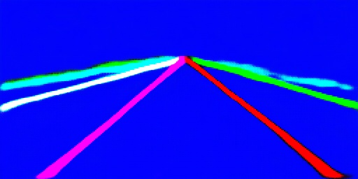

Sure! Continuing with the updated format for the README file, here's the rest of the **Training Instructions** section.

---

## Training Instructions
To train a lane detection model, use the following CLI options:

```
python train.py --dataset <path/to/your/dataset> --model_type <model_type> [OPTIONS]
```

### Required Arguments
- `--dataset`: Path to the dataset, which should contain `train.txt` and `val.txt`.
- `--model_type`: Choose the model to train. Available options are:
  - `lanenet`
  - `scnn`
  - `laneatt`

### Optional Arguments
- `--loss_type`: The type of loss function to use for training. Default is `FocalLoss`.
- `--save`: Directory where model checkpoints and logs will be saved. Default is `./log`.
- `--epochs`: Number of training epochs. Default is `25`.
- `--width`: Resize width for input images. Default is `512`.
- `--height`: Resize height for input images. Default is `256`.
- `--bs`: Batch size for training. Default is `8`.
- `--val`: Boolean indicating if validation is used during training. Default is `False`.
- `--lr`: Learning rate. Default is `0.0001`.
- `--pretrained_model`: Path to a pretrained model file, if you wish to fine-tune an existing model.
- `--backbone`: For `LaneNet`, select the backbone type. Available options are `ENet`, `UNet`, `DeepLabv3+`, `LinkNet`, `BiSeNet`, `ERFNet`. Default is `ENet`.
- `--laneatt_backbone`: For `LaneATT`, choose the backbone. Available options are `resnet50`, `resnet34`, and `resnet18`. Default is `resnet50`.

### Example Training Commands

To train using the example folder with the `ENet` backbone:
```
python train.py --dataset ./data/training_data_example --model_type lanenet --backbone ENet
```

To train using the TuSimple dataset with `UNet` backbone and `FocalLoss`:
```
python train.py --dataset path/to/tusimpledataset/training --model_type lanenet --backbone UNet --loss_type FocalLoss
```

To train using the `DeepLabv3+` backbone:
```
python train.py --dataset path/to/tusimpledataset/training --model_type lanenet --backbone DeepLabv3+
```

To train using `LaneATT` with `resnet50` backbone:
```
python train.py --dataset path/to/tusimpledataset/training --model_type laneatt --laneatt_backbone resnet50
```

## Testing the Model
After training, you can test the trained model with an image using the following command:
```
python test.py --img <path_to_test_image> --model <path_to_trained_model>
```

### Example Testing Command
To test using an image with a trained `LaneNet` model:
```
python test.py --img ./data/tusimple_test_image/0.jpg --model ./log/best_model.pth
```

### Optional Arguments for Testing
- `--backbone`: Specify the backbone used during model training.
- `--json`: Provide the path to the post-processing JSON file, used for inference.

## Results
After running the training and testing, you will see output images like the following:

- **Input Image**:
  

- **Binary Output**:
  

- **Instance Segmentation Output**:
  

## Discussion
The architecture of `LaneNet` is based on `ENet`, which is a very lightweight model, making it suitable for real-time applications. However, `ENet` may not be the best-performing model for lane detection and instance segmentation. To address this, the project also supports several backbone networks, including `UNet`, `DeepLabv3+`, `LinkNet`, `BiSeNet`, and `ERFNet`. 

### Supported Features
- **Different Backbone Networks**: The model can be trained with various backbones to suit different accuracy and efficiency requirements.
- **Flexible Loss Functions**: You can use either `FocalLoss` or `CrossEntropyLoss` to handle class imbalance during lane detection.
- **Extended Model Options**: Besides `LaneNet`, the project also supports `SCNN` and `LaneATT` models, which are state-of-the-art methods for lane detection.

### Future Work
- [x] Support for `ENet`, `UNet`, and `DeepLabv3+` backbones.
- [x] Discriminative loss function for instance segmentation.
- [x] Integration of Focal Loss for improved binary branch performance.
- [ ] Integration of ViT as an encoder (coming soon).
- ~~[ ] Post-processing improvements (delayed)~~
- ~~[ ] Integration of H-Net into the main `LaneNet` model~~ 

## References
The `LaneNet` project refers to the following research and projects:

- **Neven, Davy, et al. "Towards end-to-end lane detection: an instance segmentation approach."** 2018 IEEE Intelligent Vehicles Symposium (IV). IEEE, 2018.
  
  ```
  @inproceedings{neven2018towards,
    title={Towards end-to-end lane detection: an instance segmentation approach},
    author={Neven, Davy and De Brabandere, Bert and Georgoulis, Stamatios and Proesmans, Marc and Van Gool, Luc},
    booktitle={2018 IEEE intelligent vehicles symposium (IV)},
    pages={286--291},
    year={2018},
    organization={IEEE}
  }
  ```

- **Paszke, Adam, et al. "Enet: A deep neural network architecture for real-time semantic segmentation."** arXiv preprint arXiv:1606.02147 (2016).
  
  ```
  @article{paszke2016enet,
    title={Enet: A deep neural network architecture for real-time semantic segmentation},
    author={Paszke, Adam and Chaurasia, Abhishek and Kim, Sangpil and Culurciello, Eugenio},
    journal={arXiv preprint arXiv:1606.02147},
    year={2016}
  }
  ```

- **De Brabandere, Bert, Davy Neven, and Luc Van Gool. "Semantic instance segmentation with a discriminative loss function."** arXiv preprint arXiv:1708.02551 (2017).
  
  ```
  @article{de2017semantic,
    title={Semantic instance segmentation with a discriminative loss function},
    author={De Brabandere, Bert and Neven, Davy and Van Gool, Luc},
    journal={arXiv preprint arXiv:1708.02551},
    year={2017}
  }
  ```

The implementation is also inspired by the following GitHub repositories:

- [MaybeShewill-CV/lanenet-lane-detection](https://github.com/MaybeShewill-CV/lanenet-lane-detection)
- [klintan/pytorch-lanenet](https://github.com/klintan/pytorch-lanenet)
- [deeplabv3plus-pytorch](https://github.com/YudeWang/deeplabv3plus-pytorch) (DeepLabv3+ Encoder and Decoder)

--- 

This updated version of the README provides clear training and testing instructions, reflecting the use of CLI arguments as described in your provided training script. Let me know if this covers everything or if you'd like further adjustments!
